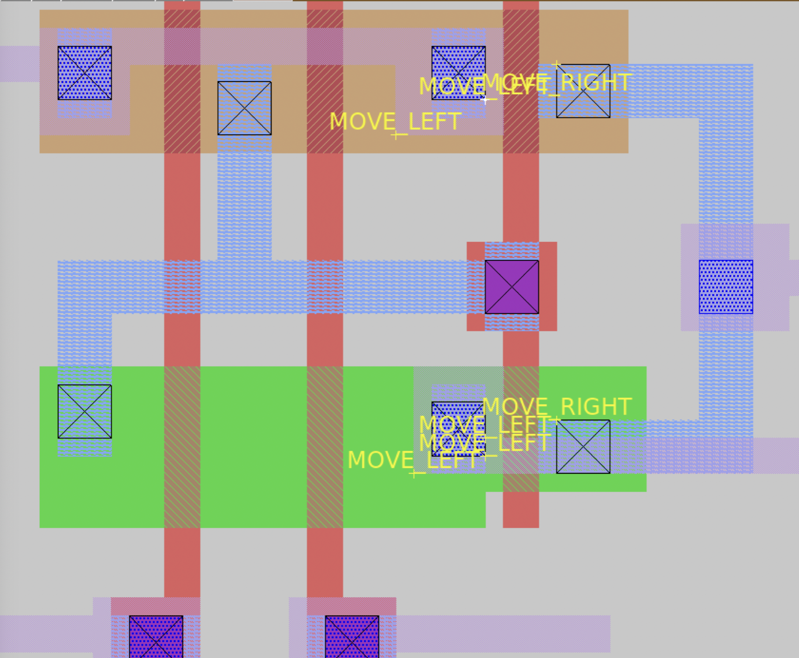
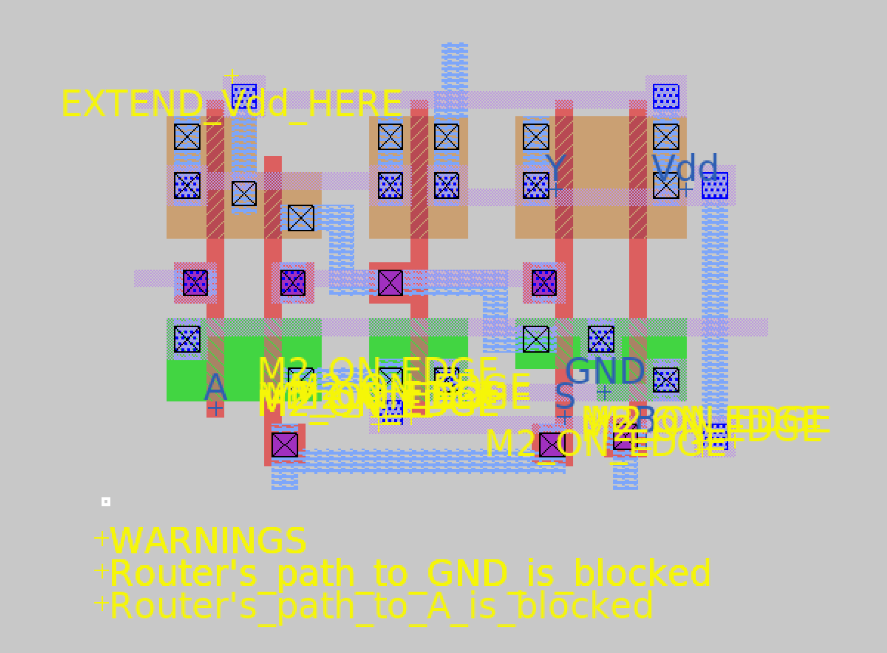

# Post-Wiring Pre-Routing .Rect File Design Checker

Rectcheck is a tool created by Sophia DeVito and Tanya Shibu as a final project for Silicon Compilation (EENG 426). It is a python script that is designed to identify elements in a .rect file that may be difficult for the router to handle, and will therefore cause DRC violations once the cell is routed using the interact tool. Once it identifies these possible problem areas, it generates a magic script to label them, so that the user can easily edit the cell and avoid the error. To decide which elements might cause issues, the tool takes into account the design strategies we discovered through trial and error in Lab 4. It is editible so that it is useful for different design rules and requirements.

Note: Due to issues with TritonRoute, this checker is based only on lessons learned for GND/Vdd routing. Also, the checker assumes router connects only vertically. With improvements, this would be converted into a editable parameter depending on what the user wants. 

---
Specifically, this tool identifies four key problems that may lead to DRC errors when a cell is routed:

In rectcheck.py:

1. It ensures that all of the elements that the router might choose as connection ports are a minimum distance of **port_distance** away from each other. This is in order to avoid ports being so close to each other that the routed connections connect to more than one accidentally. The minimum distance value can be changed depending on the design rules or routing expectations for the cell. 

3. It ensures that there is a m2 connection for Vdd and GND. If there is not, the router will have trouble making these connections.

In rectcheck2.py (with functions.py)

3. It checks the distance between the outer edge of eligible wires (that the router sees as options to connect to) and the perimeter of the cell. If the router is trying to connect to a port that is too far from the perimeter, it again may accidentally connect to more than the intended metal. 

5. It checks if there are other m2 wires close to the edge (but not an intended port/not the closest) which may result in DRC violations or shorts when the router makes a contact, since the distance between these would be too small.  

---
To use this tool, follow these steps in the docker container:
1. Generate a file example.rect that has already gone through manual wiring and routing using `mag2rect_sky130.py example.mag > example.rect`
2. Run `python rectcheck.py example.rect` or 'rectcheck2.py example.rect' to generate a new magic script, labels.scr
3. Generate a .tcl file from that .rect file using `mag.pl example.rect > example.tcl`
4. Open magic and run the command `source example.tcl`
5. Run the command `select` to select the topmost cell in the window. (Optional step: run `erase label` to remove exsisting labels in order to see the ones gerenated by rectcheck.py clearly)
6. Manually select the bottom left corner of the selection window
7. Run `source labels.tcl` to generate the suggested edits to your cell
---
This repo includes a few example files to demonstrate the capabilities of this tool. Here is a visual of the generated labels for the  *_0_0std_0_0cells_0_0AND2X1.rect* file (included in the exampples folder). It identifies that the metal wires on either side of the rightmost polysilicon are too close to each other, which might be difficult for the router to handle. So our tool has flagged their wires and instructed to user to move them apart using 'MOVE RIGHT' and 'MOVE LEFT' labels.

Also in /examples/MUX2X1, there is an mag file showing the result of rectcheck2.py, as well as the labels.scr script and .rect file used to produce it. Here is a screenshot showing the warning labels and relabeled ports:

---
**Sophia's Contribution:**
- rectcheck.py. Wrote python code to 
  - Read in .rect files and check arguments
  - Generate magic script with labels
  - Go through .rect file and identify ports and other metal sections
  - Make sure there is m2 connected to GND and Vdd
  - Check if ports are too close to each other, and label those errors
- Added example files to run the python script on
- Wrote first draft of the README file, including instructions on how to run the tool
- Last commit: [95d124f9d9227e13f73e0d14f20b7ffc4553f3cd](https://github.com/devitos-yale/eeng426final/tree/95d124f9d9227e13f73e0d14f20b7ffc4553f3cd)

**Tanya's Contribution:**
- Wrote rectcheck2.py and functions.py to add onto rectcheck.py. 
  - Parse .rect file to get unique I/O names for the cell, identify ports and obstacles, and other info
  - Looks for eligible ports (i.e. wires that router may connect to). Code does not depend on 'inrect' or 'outrect', since this may not always be present
  - Check 1: Ports must be close enough to top/bottom perimeter
      - Sees if at least one port is close enough to top/bottom perimeter. 
      - If not, suggests easiest wire with a free path to the perimeter, where the user can extend the wire (labels "EXTEND_name_HERE").
      - If no wires have a free path to the perimeter, generates a WARNING label.
  - Check 2: If other m2s are close to the edge
      - May cause a DRC violation
      - Generates warning label, "M2_ON_EDGE"
  - Relabel ports - since we erase all labels before running labels.scr, one label for each wrire is redrawn  
